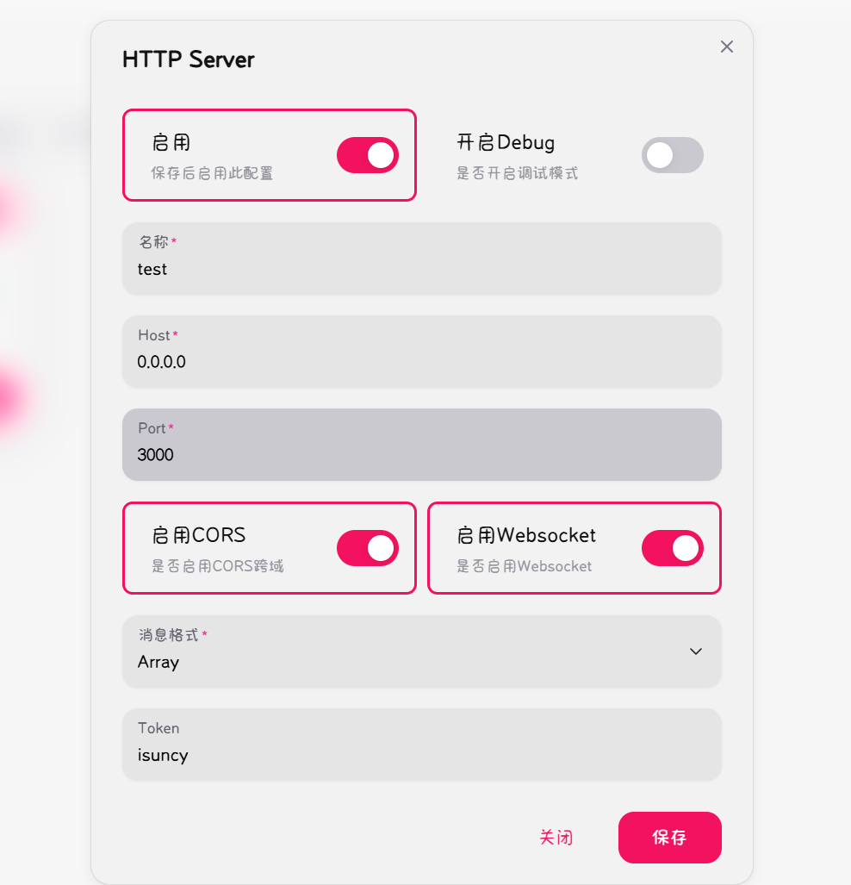
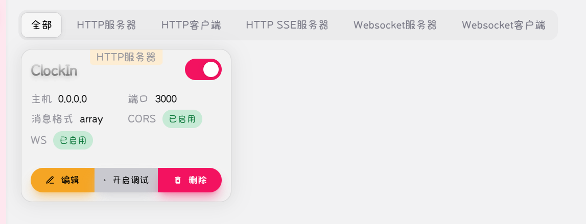

# qqbot-ClockInAddon
Python实现的基于napcat的qq机器人 打卡签到插件（整活版）
### 使用方法
首先配置napcat（官网链接：https://napneko.github.io/guide/napcat）

在网络配置种添加一个HTTP服务器并启用

token为`isuncy`


在settings.json中添加要监听的群组或个人的qq号

运行
```python
python main.py
``` 
即可使用
